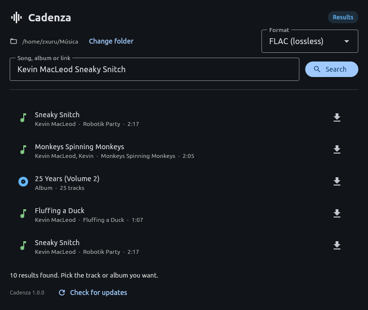

# Cadenza



Search YouTube for a song or an album, look at what came back, then download it
as tagged audio with a real cover.

One download per platform, and nothing to install on the machine that runs it:
Python, ffmpeg, a JavaScript runtime and the Flet desktop client are all inside
the executable (inside the app bundle on macOS, inside the APK on Android).

## Install

Download the file for your platform from the [latest
release](https://github.com/zxuru/cadenza/releases/latest):

| Platform | File | Then |
| --- | --- | --- |
| Linux x86_64 / arm64 | `linux-<arch>.tar.gz` | `tar -xzf`, then run `./Cadenza` |
| Windows x64 | `windows-x86_64.exe` | Run it (Windows on ARM: this build, emulated) |
| macOS arm64 / x86_64 | `macos-<arch>.zip` | Unzip, drop `Cadenza.app` wherever you keep apps |
| Android 7+ | `cadenza-arm64-v8a.apk` (or `cadenza-armeabi-v7a.apk` on an old 32-bit phone, `cadenza-x86_64.apk` on an emulator) | Copy it to the phone and open it |

| Platform | Requirement |
| --- | --- |
| Linux | Ubuntu 24.04 or newer (older distributions need a build on that distribution) |
| Windows | 64-bit Windows 10 or 11 |
| macOS | macOS 12 or newer, Intel or Apple silicon |
| Android | Android 7 or newer, `arm64-v8a`, `armeabi-v7a` or `x86_64` |
| Any | ~70 MB of disk (~91 MB for an APK) and a network connection |

Nothing else is needed: no Python, no ffmpeg, no `PATH` entries, no admin
rights. The first launch takes a few extra seconds, when the Flet client is
unpacked into `~/.flet/client/`; later launches reuse it.

The binaries are not signed or notarized, so Windows SmartScreen warns once
("More info" → "Run anyway") and macOS asks you to allow the app in **Privacy &
Security** the first time. On Linux, `chmod +x` if the archive was unpacked by
something that dropped the executable bit. On Android the APK is signed with a
debug key, so the system warns about an unknown developer.

The first launch asks where your music goes, and shows the folder in the header
afterwards — "Change folder" moves it. Downloads are one folder per album.

## What it does

- **Search** returns tracks and albums from YouTube, music uploads first: the
  same recording is usually on YouTube both as the release and as a re-upload by
  an unrelated channel, and only one of the two carries the release's metadata.
- **An album is read before it is downloaded.** Pick one and the track list
  appears; the download starts when you confirm it. Each track keeps the
  position it has in the release you picked.
- **Progress** is per track: downloaded, total, speed and ETA, then the
  conversion, then the metadata lookup.
- **Tags and cover art** come from a music database, not from the video: iTunes
  Search first (one request carries album, album artist, track and disc number,
  genre and a square cover), Deezer as fallback. A track the databases do not
  know keeps whatever tags the upload carried.
- **Cover art** is 4:3 when it comes from the video thumbnail, because that is
  the shape players frame covers in, and square when it comes from a database.

| Format | Linux | Windows | macOS | Android |
| --- | --- | --- | --- | --- |
| FLAC | yes | yes | yes | yes |
| M4A (AAC 320 kbps) | yes | yes | yes | yes |
| WAV (PCM) | yes | yes | yes | yes |
| MP3 (320 kbps) | yes | yes | yes | no |

Android has no MP3 because the encoder for it (`libmp3lame`) is the one encoder
ffmpeg's Android builds do not carry; the dropdown offers what the machine can
actually produce, so a conversion never fails halfway through.

## Updating

CI builds and publishes a release on every push to `main`, so the latest release
is always the latest code. The version is `<major>.<minor>.<build number>`, the
build number being the CI run: `1.0.57`, then `1.0.58`. A `v1.2.3` tag publishes
exactly that version instead.

The app does **not** check by itself. The footer shows the version it is running
and a **Check for updates** button; pressing it looks at the latest release,
downloads the file for your platform, checks it against the `SHA256SUMS` in the
release, replaces itself and restarts. It waits for a download in progress to
finish first, and a build you made yourself from a checkout is never replaced.

On Android the button opens the release page instead, because an app cannot
install an APK from inside itself.

## Where things are

| What | Path |
| --- | --- |
| Settings | `~/.config/Cadenza/config.json` (Linux), `%APPDATA%\Cadenza\config.json` (Windows), `~/Library/Application Support/Cadenza/config.json` (macOS), the app's own data directory on Android |
| Music | the folder chosen on the first run, one directory per album |
| Flet client | `~/.flet/client/`, unpacked on the first launch |

## How it works

[youtube-dl's successor](https://github.com/yt-dlp/yt-dlp) does the extraction,
with a bundled QuickJS as the JavaScript runtime it needs to solve YouTube's
signature challenges; a system `deno`, `node`, `bun` or `quickjs` is used
instead when there is one. QuickJS is 2.5 MB where the runtime yt-dlp enables by
default, Deno, is 96 MB - and it solves the same challenges. ffmpeg (the static build from `imageio-ffmpeg`) does
the conversion and the video-frame fallback for cover art. On Android, where an
app may not execute a binary it ships, the conversion runs in-process through
PyAV and the bundle carries ffmpeg's libraries instead. mutagen writes the tags
and the picture. The UI is [Flet](https://flet.dev), which is Flutter with a
Python backend.

## Building

`BUILD.md` has the whole story (what ends up inside each artifact and why, the
self-test, the release flow). The short version:

```bash
python3 -m venv .venv
.venv/bin/python -m pip install -r requirements.txt pyinstaller
.venv/bin/python build.py                    # dist/Cadenza

.venv/bin/python -m pip install "flet[all]==1.0.0"
.venv/bin/flet build apk --yes               # build/apk/cadenza.apk
```

Neither tool cross-compiles, so CI builds each target on a platform that can:
the desktop executables with `build.py` on Linux, Windows and macOS, the APK
with `flet build` on Linux. iOS and the web are not targets: iOS forbids both
executing a bundled binary and loading your own libraries, and Pyodide has no
processes and no files that survive a reload.

## Languages

The interface follows the system language: English and Spanish today, one JSON
file per language in `locales/` — dropping a file in is the whole registration
step. `python i18n.py` checks a translation against English.
